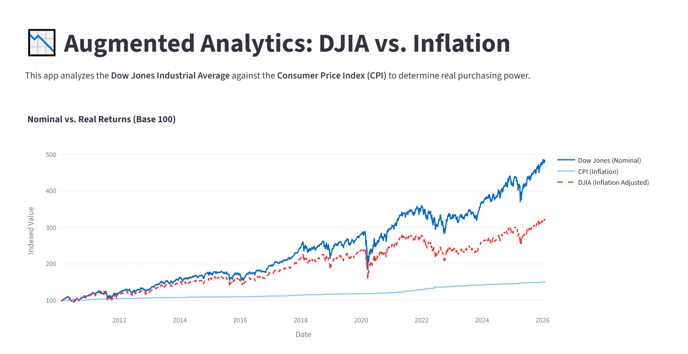
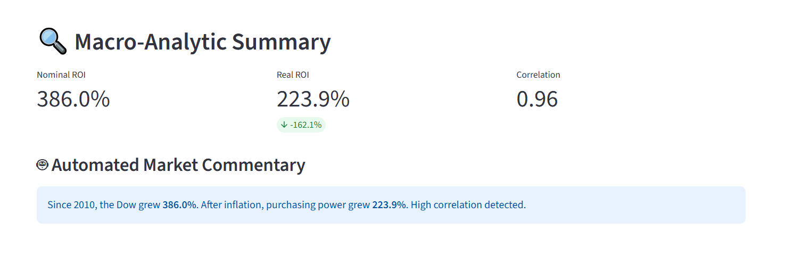

# 📉 Macro-Equity Intelligence Hub
### Augmented Analytics: Visualizing the 'Money Illusion' in Equity Markets

[](https://macro-equity-intelligence.streamlit.app/)

## 🎯 The Problem
In a high-inflation environment, nominal stock market gains can be deceptive. While the Dow Jones might hit all-time highs, it doesn't always mean investors are gaining real-world purchasing power. 

I built this **Augmented Analytics** tool to bridge the gap between equity indices and macroeconomic fundamentals. By adjusting the Dow Jones Industrial Average (DJIA) for the Consumer Price Index (CPI), this app reveals the "Real" growth of the market, filtering out the noise of monetary inflation.

---

## 🖼️ App Preview



---

## 🚀 Live Demo
**Interact with the live dashboard here:** [macro-equity-intelligence.streamlit.app](https://macro-equity-intelligence.streamlit.app/)

## 🛠️ The Tech Stack
This project demonstrates a full-cycle data product, from raw API ingestion to cloud deployment:

- **Python:** The core engine for all logic.
- **Streamlit:** For building the interactive UI and real-time dashboard.
- **yFinance:** To source live equity data for the DJIA.
- **Pandas & NumPy:** For time-series alignment, data cleaning, and correlation logic.
- **Plotly:** To generate interactive, financial-grade visualizations.

## 🧠 How the 'Augmented' Logic Works
This app goes beyond basic charting by implementing active analytical logic:

1. **Live Data Integration:** The app fetches the latest CPI data from the St. Louis FED (FRED) and daily closes for the Dow Jones.
2. **Dynamic Normalization:** Both datasets are indexed to a 'Base 100' starting at the user's selected date, allowing for an "apples-to-apples" comparison.
3. **The Real Value Calculation:** $$Real Value = \frac{Nominal Index}{CPI Index} \times 100$$
4. **Automated Insights:** An automated commentary engine runs a **Pearson Correlation Coefficient** between the index and inflation to determine if the market is being driven by fundamental growth or currency devaluation.

---

## 💻 Local Setup
If you want to run this project on your local machine:

1. **Clone the repository:**
   ```bash
   git clone https://github.com/o-danalyst/macro-equity-intelligence.git
   cd macro-equity-intelligence
   ```

2. **Install dependencies:**
   ```bash
   pip install -r requirements.txt
   ```

3. **Launch the App:**
   ```bash
   streamlit run App.py
   ```

---

## 📂 Project Structure
- `App.py`: The main application logic, data pipeline, and UI layout.
- `requirements.txt`: Necessary Python libraries for deployment.
- `README.md`: Documentation and project overview.
- `Visuals`: Contains images taken from the live demo

## 👤 Author
**Clinton Onaga**
*I’m a Data & Market Analyst focused on turning raw data into decision-ready insights.

My work sits at the intersection of:
- data analysis & visualization
- automation of repetitive analytical workflows
- market analysis (technical + macro fundamentals)

I’m currently building hands-on experience in **augmented analytics** and **AI-driven automation**, with an emphasis on practical systems that reduce manual work and improve decision-making.
*
[GitHub Profile](https://github.com/o-danalyst) | [LinkedIn](https://www.linkedin.com/in/clinton-onaga-b86027375/)

---
*Developed as a demonstration of Augmented Analytics and Macroeconomic modeling.*
